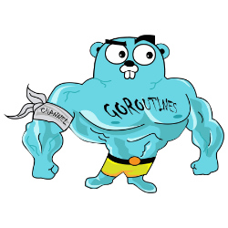

<h1 align="center">Hi there✨, I am ferreira</h1>

<em>      
- 💀I'm a 17 year man from Brazil [🇧🇷]
 
- 💻Currently studying <b>Web offensive security (Pentest)</b>, reconnaissance, bug bounty and other things
       
- 💀Like doing <b>ctfs</b>, such as <b>hackthebox</b>, and <b>hackingclub.io</b>!
       
- 🎯Started at 07/15/2021
</em>

 

## <b> Skills</b>
 

- **Languages**:
    
    
    
    
    
    

    
    
- **Front-End**:

   
   
   

 

- **Softwares and Tools**:

    
    
    
    
    
    
    

 

- **Extras**:

    
    
    
    
    
          
          

 

### Contacts:

 

    

 #   
